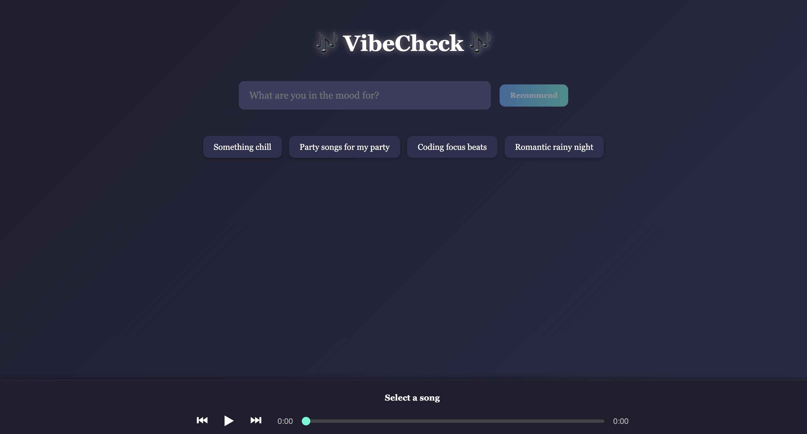
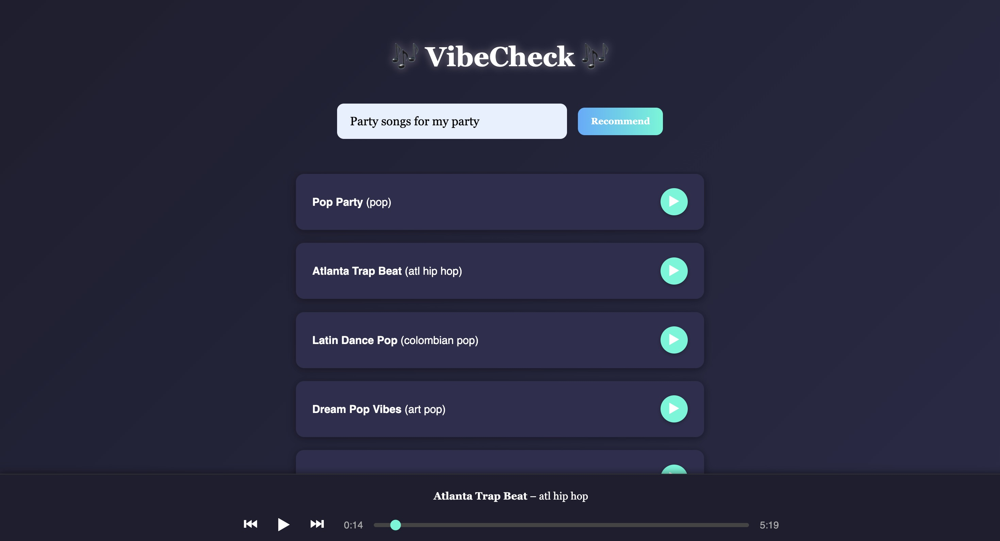

# 🎶 VibeCheck

**VibeCheck** is an AI-powered music recommendation app that suggests songs based on your mood or natural-language prompt (like “party songs for my birthday” or “romantic rainy night”).

## 🔥 Features

- 🎤 Prompt-based music recommendations
- 🔎 Fuzzy search using genre, mood, pace, and song name
- 🎧 Audio player with play/pause, next/previous, and seek functionality
- ⌛ Displays current and total song duration
- 💡 Suggested prompts to get you started

---

## 🖼️ Preview


,

---

## 🧠 Technologies Used

- **Frontend**: React.js, CSS, HTML5 Audio API
- **Backend**: Flask, Python, MySQL
- **AI Matching**: FuzzyWuzzy, NLTK
- **UI Enhancements**: CSS Animations, Responsive Layout

---


## 🚀 Getting Started

### Backend

1. Navigate to the `backend/` folder and run the Flask server:
```bash
cd backend
python3 -m venv venv
source venv/bin/activate
pip install -r requirements.txt
python app.py
```
Make sure your MySQL database and table are correctly configured and populated.

### Frontend

2. Start the React app in `frontend/`:
```bash
cd frontend
npm install
npm run dev
```

By default:
- React app runs at `http://localhost:5173`
- Flask backend runs at `http://localhost:5050`

---

## 🧩 To Do / Future Features

- Add song thumbnails or album art
- Save history of prompts and recommended songs
- Add keyboard shortcuts to trigger drum sounds
- Animate drums with SVG or Lottie

---

## 📬 Contact

Built with ❤️ by Payal Jadhav.  
Have feedback or want to contribute? Feel free to email: jpayal0110@gmail.com
